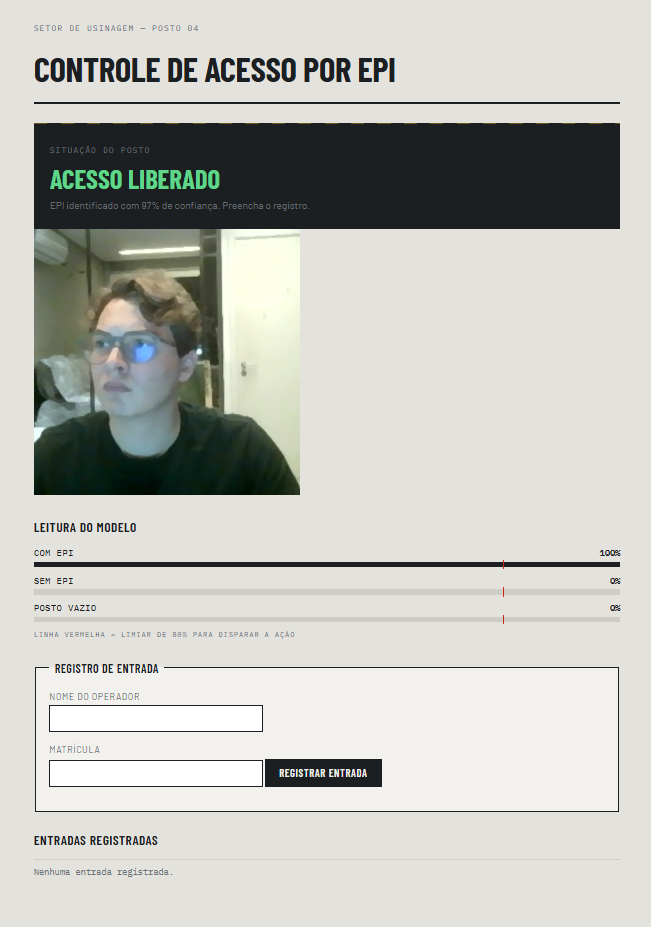

# Controle de acesso por EPI

Aplicação web que usa um classificador de imagens treinado no Teachable Machine para verificar, pela webcam, se o operador está usando o EPI antes de liberar o registro de entrada em um posto de trabalho.

A classificação acontece em tempo real no navegador. Quando o modelo identifica o operador com o EPI, o formulário de registro é **liberado automaticamente** — sem nenhum clique. Se o EPI deixa de ser identificado, o formulário é bloqueado na mesma hora.

**Autor:** Guilherme Albuquerque Dos Reis Gomes

---

## Print da aplicação



---

## Classes treinadas

| Classe | O que representa |
| --- | --- |
| `com_epi` | Operador em frente à câmera usando o EPI |
| `sem_epi` | Operador em frente à câmera sem o EPI |
| `vazio` | Nenhuma pessoa no posto (classe neutra) |

A classe `vazio` existe para evitar falsos positivos: sem ela, o modelo seria obrigado a escolher entre `com_epi` e `sem_epi` mesmo quando não há ninguém na frente da câmera, e a interface reagiria sozinha a um posto vazio.

---

## A ação disparada pela predição

A predição é filtrada antes de virar ação, por dois critérios definidos no topo do `app.js`:

- **Limiar de confiança (`LIMIAR = 0.80`)** — leituras abaixo de 80% de confiança são descartadas. Predições de baixa confiança são instáveis e fariam a interface oscilar.
- **Estabilidade (`LEITURAS_PARA_CONFIRMAR = 5`)** — a mesma classe precisa se repetir em 5 leituras consecutivas (cerca de meio segundo) antes de mudar o estado da tela.

Passando nos dois filtros, a função `executarAcao()` altera o atributo `disabled` do formulário:

| Classe identificada | Ação automática |
| --- | --- |
| `com_epi` | Formulário liberado, placa em verde |
| `sem_epi` | Formulário bloqueado, placa em vermelho |
| `vazio` | Formulário bloqueado, placa em espera |

O botão "Registrar entrada" é um clique manual do operador, mas ele só existe porque a liberação já aconteceu sozinha.

---

## Como rodar localmente

### O que você precisa

- Um navegador atualizado (Chrome, Edge ou Firefox)
- Uma webcam
- Um servidor local — a webcam não funciona abrindo o arquivo direto do disco (`file://`), o navegador bloqueia por segurança

### Passo a passo

1. Clone o repositório:

   ```bash
   git clone https://github.com/GuiAlbg/epi-detector.git
   cd epi-detector
   ```

2. Suba um servidor local na pasta do projeto. Qualquer uma destas opções serve:

   **VS Code** — instale a extensão *Live Server*, clique com o botão direito no `index.html` e escolha "Open with Live Server".

   **Python** (já instalado na maioria das máquinas):

   ```bash
   python -m http.server 8000
   ```

   **Node.js**:

   ```bash
   npx serve
   ```

3. Abra o endereço que o servidor mostrar (normalmente `http://localhost:8000`).

4. Autorize o uso da câmera quando o navegador pedir.

O modelo já está versionado na pasta `model/` — não é preciso baixar nada além do repositório.

---

## Estrutura do projeto

```
epi-detector/
├── index.html      estrutura da página e estilos
├── app.js          carregamento do modelo, loop de predição e ação
├── model/          modelo exportado do Teachable Machine
│   ├── model.json
│   ├── metadata.json
│   └── weights.bin
└── README.md
```

---

## Tecnologias

- **Teachable Machine** — treinamento do classificador de imagens
- **TensorFlow.js** — inferência no navegador, sem back-end
- **HTML, CSS e JavaScript** — sem framework e sem etapa de build

---

## Observações

Os nomes das classes no `app.js` (constante `CLASSES`) precisam ser idênticos aos nomes usados no Teachable Machine. Se forem alterados lá, precisam ser alterados aqui também.
